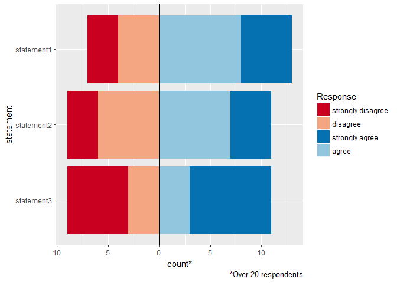

<!-- README.md is generated from README.Rmd. Please edit that file -->
DTCsurvey
=========

Th DTCsurvey package contains a set of functions I created to facilitate a survey analysis I'm conducting for my dissertation work in Public Health Genetics at the University of Washington. I thought these functions could be useful for others analyzing survey data in R, so am making them available here.

Example
-------

Here is an example of the `b2b_barplot` function which creates a back to back barplot of Likert-like responses (e.g. levels of agreement) to a cluster of survey items.

``` r
#library(DTCsurvey)
devtools::load_all()
#> Loading DTCsurvey
library(ggplot2)
library(reshape2)
library(dplyr)
 
# with no grouping
dat <- data.frame(matrix(sample(1:4,60, replace=TRUE), nrow=20,ncol=3))
names(dat) <- paste0("statement",1:ncol(dat))
b2b_barplot(raw=dat)
```



``` r

# with grouping
dat$sex <- c(rep("M",times=10), rep("F",times=10))
b2b_barplot(raw=dat, group_var = "sex")
```


